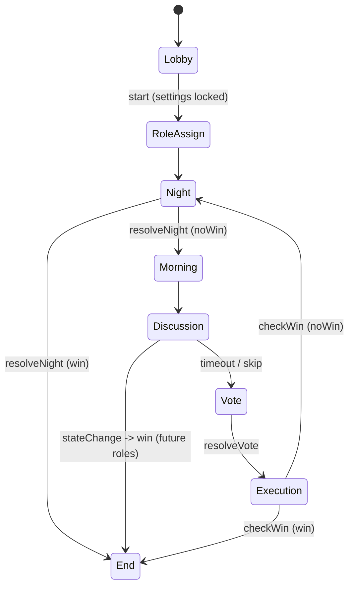

---

name: discord-werewolf-bot
overview: Discord 上で人狼ジャッジメント準拠ルールの人狼ゲームを遊べる TypeScript ベースの Discord Bot を実装する。まずは 6 役職（人狼・市民・占い師・霊能者・狩人・狂人）に限定し、後から新役職を追加しやすいアーキテクチャを設計する。
todos:

- id: setup-project
content: TypeScript + Node.js プロジェクトを作成し、discord.js を導入して基本的な起動処理と /ping コマンドを実装する
status: done
- id: design-game-model
content: Game, Player, Role インターフェースと GameManager の型設計・実装を行う
status: done
- id: implement-lobby-flow
content: ロビー〜役職配布までのフロー（/werewolf create, /werewolf join, /werewolf start と役職 DM 通知）を実装する
status: done
- id: implement-night-input
content: 夜フェーズ開始時に行動者（人狼・占い師・狩人）へ DM でセレクトメニューを送り、回答を nightActions に保存するまでの入力収集ロジックを実装する
status: pending
- id: implement-night-resolve
content: resolveNight() を実装する。護衛→襲撃判定・占い師への結果DM・霊媒師へのパッシブ通知を含む各役職の夜行動ロジックをまとめて解決する
status: pending
- id: implement-day-phases
content: 朝フェーズ（犠牲者公開）・昼フェーズ（議論タイマー）・投票フェーズ（生存者セレクトメニュー UI・投票収集）を実装する
status: pending
- id: implement-execution
content: 処刑フェーズを実装する。投票集計・同票処理・処刑結果のチャンネル公表・次フェーズ（夜 or 終了）への遷移を行う
status: pending
- id: implement-win-conditions
content: checkWinConditions() と終了フェーズを実装する。村人勝利・人狼勝利の判定、全役職の公開、勝利陣営のアナウンスを行う
status: pending
- id: improve-error-handling
content: コマンドの不正利用やフェーズ不一致時のエラーメッセージなどガード処理を強化する
status: pending
- id: document-role-extension
content: 新役職を追加するための手順と Role API を簡潔にドキュメント化する
status: pending
isProject: false

---

## 目的

- **目的**: JavaScript/TypeScript で Discord Bot を実装し、Discord 上で人狼ジャッジメントと同様のルール・進行で人狼ゲームを遊べるようにする。
- **第1フェーズの範囲**: 役職は「人狼」「市民」「占い師」「霊能者」「狩人」「狂人」の 6 つのみ。1村あたり 6〜8 人程度を想定し、1ギルドで複数村が同時進行できる構成を可能にする。
- **重視点**: 後から新役職・新ルールを追加しやすいように、役職やフェーズ進行をプラガブルにする。

## 全体アーキテクチャ

- **使用技術**
  - **言語**: TypeScript（Node.js ランタイム）
  - **Discord ライブラリ**: `discord.js` v14 系を想定（スラッシュコマンド & ボタン/セレクトメニュー UI 対応）
  - **構成**: 単一 Node プロジェクト。
  - **データ永続化**: 第1フェーズではメモリ上に保持（1 プロセス想定）。将来の拡張では Redis / DB に差し替えやすいように抽象化。
- **ディレクトリ構成（案）**
  - `[src/index.ts]`: Bot 起動・ログイン、イベント登録。
  - `[src/config.ts]`: 環境変数・定数（ゲーム設定、タイムアウト秒数など）。
  - `[src/discord/commands/*]`: スラッシュコマンド定義とハンドラ。
  - `[src/discord/interactions/*]`: ボタン・セレクトメニュー等のインタラクションハンドラ。
  - `[src/game/GameManager.ts]`: 村の管理（複数ゲーム管理、ゲーム作成/取得/破棄）。
  - `[src/game/Game.ts]`: 1 村分のゲームロジック（状態遷移、投票集計など）。
  - `[src/game/state/*]`: フェーズごとの状態クラス or ステートマシン実装。
  - `[src/game/roles/*]`: 役職インターフェースと各役職クラス（人狼、市民、占い師、霊能者、狩人、狂人）。
  - `[src/game/models/*]`: プレイヤー、投票、ログなどの型定義。
  - `[src/utils/*]`: 共通ユーティリティ（乱数、時間制御、ID 生成など）。
- **デザインパターン**
  - **State パターン**: 昼・夜・投票・処刑後などの進行をフェーズクラスとして表現。
  - **Strategy / Polymorphism**: 役職ごとの夜行動・勝敗判定ロジックを `Role` インターフェース実装にカプセル化し、新役職は新クラス追加で拡張。
  - **EventEmitter 風内部イベント**（任意）: プレイヤー死亡、フェーズ切り替えなどをイベントで通知し、ログ出力や統計などを疎結合に追加可能にする。

## ゲームフロー仕様（人狼ジャッジメント準拠・簡略版）

- **前提**
  - ゲームは **`テキストチャンネル 1 つ = 1 村`** を基本単位とする。
  - システムメッセージ・進行はその村のチャンネルに投稿する。
  - 個別の夜行動入力は **DM のセレクト/ボタン**（第1フェーズの基本）で受け付ける。
  - **人狼専用チャット（採用仕様）**: 人狼プレイヤーが Bot に DM した内容を、同村の他の人狼プレイヤーへ Bot が DM 転送する（村ごとに混線しないようルーティングする）。
  - **ゲーム設定の編集**: **ゲーム作成時**および**作成後〜開始前（ロビー中）**のみ編集可能（`/werewolf settings ...`）。開始後は固定。

- **フェーズとイベント（最新版）**
  1. **ロビー（募集 + 設定）**
     - `/werewolf create` で村作成 → 募集メッセージ投稿。
     - `/werewolf join` で参加、`/werewolf leave` で退出（開始前のみ）。
     - ロビー中にホストが設定を編集できる:
       - `/werewolf settings show`（現在値表示）
       - `/werewolf settings roles`（使用役職セット）
       - `/werewolf settings anonymous-vote`（匿名投票）
     - `/werewolf start` 実行で開始（開始前に **設定バリデーション**: 参加人数、役職セット整合、DM 受信可否など）。
  2. **役職配布**
     - 参加者へ役職を割り当て、**各自へ DM 通知**。
     - 人狼には「仲間一覧」を DM し、人狼専用チャット（DM 中継）の使い方も案内する。
  3. **夜（行動入力 → 解決）**
     - **行動入力（収集）**: 行動者（人狼/占い/狩人 等）から対象選択を DM で受け付け、`nightActions` に保存。
     - **解決**: タイムアウト or 全員確定で `resolveNight()` を実行し、襲撃/護衛/各種効果をまとめて適用する。
     - **勝敗判定**: `resolveNight()` の直後に `checkWinConditions()` を実行し、勝敗確定なら終了へ。
  4. **朝（結果公開）**
     - 夜の犠牲者を公開し、死亡者を「発言不可」扱いにする（第1フェーズの簡略）。
  5. **昼（議論）**
     - 議論タイマー開始。基本は自由発言。
     - **将来役職で議論中に死亡/蘇生/陣営変更等が起こり得る**ため、それらが起きた直後は必ず `checkWinConditions()` を実行する（勝敗確定なら終了へ）。
  6. **投票（処刑投票）**
     - 生存者へ投票 UI を提示（匿名投票設定に応じて表示を変える）。
     - 投票締切後に集計して処刑者を決定（同票時の扱いは仕様で確定させる）。
  7. **処刑（解決 → 勝敗判定）**
     - 処刑結果を公表し、処刑を適用する。
     - 直後に `checkWinConditions()` を実行し、勝敗確定なら終了へ。未決なら夜へ。
  8. **ゲーム終了**
     - 勝利陣営と全員の役職を公開してクローズ。

- **勝敗判定（共通ルール）**
  - 勝敗判定は「特定フェーズに固定」しない。**生死/人数/陣営が変化した直後**に必ず `checkWinConditions()` を呼ぶ。
  - これにより「夜の襲撃で即終了」「会議中の効果で即終了」等にも対応できる。

- **簡易ステートマシン図（更新版）**

## 役職設計

- **共通インターフェース**
  - `Role` インターフェース（例）
    - `id`: 役職 ID（"werewolf" など）
    - `name`: 表示名
    - `team`: 陣営（`"wolf" | "village" | "madman"` など）
    - `nightActionType`: 夜行動の種類（`"attack" | "inspect" | "guard" | "none"` など）
    - `canActAt(nightNumber): boolean` 夜ごとに行動可能かどうか。
    - `performNightAction(context): Promise<void>` 行動の実装（選択 UI と結果適用を含めるか、行動選択と解決を分離するかは後述）。
- **ロジックの分離方針**
  - **行動選択**と**行動解決**を分ける：
    - 選択は Discord 側 UI（DM のボタン/セレクト）で入力。
    - 解決は Game 側の `resolveNight()` でまとめて処理。
  - 各役職は「どの種類の行動をするか」「どの制限を持つか」を宣言的に持たせ、具体的なターゲット選択・処理は共通ロジックに寄せると、新役職の追加が簡単になる。
- **第1フェーズで実装する役職**
  - **人狼 (`Werewolf`)**
    - 陣営: `wolf`
    - 夜行動: 生存者の中から 1 人を襲撃（人狼同士で共有）。
  - **市民 (`Villager`)**
    - 陣営: `village`
    - 夜行動: なし。
  - **占い師 (`Seer`)**
    - 陣営: `village`
    - 夜行動: 対象 1 人を占い、陣営を知る（結果は DM）。
  - **霊能者 (`Medium`)**
    - 陣営: `village`
    - 夜行動: 前日処刑者が人狼陣営かどうかを知る。
  - **狩人 (`Hunter`)**
    - 陣営: `village`
    - 夜行動: 1 人を護衛。護衛対象が襲撃されると死亡を防ぐ（連続護衛の可否はオプション）。
  - **狂人 (`Madman`)**
    - 陣営: `madman`（勝利条件は狼陣営と同じ、共有はしない）。
    - 夜行動: なし。
- **将来の役職追加方針**
  - 役職は `Role` インターフェースを実装したクラスを `[src/game/roles]` に追加するだけで登録できるようにする。
  - 役職リストは `RoleRegistry` などのレジストリで一元管理し、JSON 設定から利用する役職・人数を読み込める拡張を想定。

## データモデル

- **プレイヤー (`Player`)**
  - `id`: Discord User ID
  - `name`: 表示名（キャッシュ）
  - `roleId`: 割り当てられた役職 ID
  - `isAlive`: 生死フラグ
  - `isRevealed`: 役職公開済みかどうか（観戦などの拡張に使用可能）
  - `voteTargetId`: 現在の投票先（投票フェーズで使用）
- **ゲーム (`Game`)**
  - `id`: 内部ゲーム ID
  - `guildId`, `channelId`: この村の Discord 上の位置
  - `hostId`: 部屋主の Discord ID
  - `players: Player[]`
  - `phase`: 現在のフェーズ（`"lobby" | "roleAssign" | "night" | "morning" | "discussion" | "vote" | "execution" | "end"`）
  - `dayNumber`: 何日目か
  - `settings`: ゲーム設定（**ゲーム作成時**および**作成後〜開始前（ロビー中）**に編集可能）
    - `roles`: 使用する役職セット（ゲーム開始前に編集可能にしておく。第1フェーズではデフォルトは 6 役職）
    - `anonymousVote`: 匿名投票かどうか（`true` の場合、投票フェーズで「誰が誰に投票したか」をチャンネルに公開しない）
  - `nightActions`: 夜行動の一時保存（人狼の襲撃先、占い先、護衛先 等）
  - `voteResults`: 投票集計結果
  - `logs`: 進行ログ
- **GameManager**
  - ゲーム ID またはチャンネル ID をキーとして `Game` インスタンスを管理。
  - 主なメソッド: `createGame`, `getGameByChannel`, `endGame`, `listGames` など。

## Discord Bot 仕様

- **起動・設定**
  - `.env` などで `DISCORD_TOKEN`, `CLIENT_ID` を設定。
  - スラッシュコマンドは起動時に Discord API へ登録（`/werewolf` 名前空間などでまとめる）。
- **メインコマンド案**
  - **`/werewolf create`**
    - 説明: 現在のチャンネルに村を作成する。
    - オプション: `max_players`（最大人数）。
    - 動作: `GameManager` に新ゲームを作成し、募集メッセージを送信。ホストをコマンド実行者に設定。
    - 備考: 作成直後〜開始前（ロビー中）は、役職セットや匿名投票などの**ゲーム設定を編集できる**ようにする。
  - **`/werewolf join`**
    - 説明: 作成済みの村に参加。
    - 動作: ゲーム状態がロビーの場合にのみ `players` に追加。
  - **`/werewolf leave`**
    - 説明: ゲーム開始前なら退出、開始後は「自殺」扱いか退出不可かはルールで決める（開始前のみ許可にするのが簡単）。
  - **`/werewolf settings`**
    - 説明: ゲーム設定の表示（ロビー中のみ編集可能）。
  - **`/werewolf settings show`**
    - 説明: 現在のゲーム設定を一覧表示する。
  - **`/werewolf settings anonymous-vote`**
    - 説明: 匿名投票の ON/OFF を設定する（ロビー中のみ）。
    - オプション: `enabled`（boolean）
  - **`/werewolf settings roles`**
    - 説明: 使用役職セットを設定する（ロビー中のみ）。
    - 備考: 第1フェーズは 6 役職固定をデフォルトとしつつ、開始前に編集できる形で設計しておく。
  - **`/werewolf start`**
    - 説明: ホストのみ使用可能。募集を締め切り、役職配布を開始。
  - **`/werewolf status`**
    - 説明: 現在のフェーズ、日数、生存者一覧を表示。
  - **`/werewolf end`**
    - 説明: 強制終了。ホスト or 管理者のみ。
- **インタラクション UI**
  - **参加ボタン**: ロビーのメッセージに「参加する」「退出する」ボタンを付ける（スラッシュコマンドと併用）。
  - **投票 UI**: 生存者一覧から選択するセレクトメニュー。
  - **夜行動 UI**: DM で対象を選ぶセレクトメニュー or ボタン。
- **エラー・例外パターン**
  - 既にゲームが存在するチャンネルで `create` した場合 → エラーメッセージ。
  - すでにゲームが存在するサーバーで `create` した場合 → エラーメッセージ（暫定）。
  - フェーズ不一致のコマンド（例: 進行中に `join`） → 使用不可メッセージ。
  - 行動済みの夜に再度行動しようとした場合 → 行動済みメッセージ。

## 勝敗条件

- **村人陣営勝利**
  - 全ての人狼が死亡したとき。
- **人狼陣営（人狼 + 狂人）勝利**
  - 生存している人狼陣営の人数が村人陣営の人数以上になったとき（人狼ジャッジメントに準拠した簡略条件）。
- **引き分け**
  - 全員死亡など想定外ケースに備えて定義（基本は発生しない）。

## 拡張性のためのポイント

- **役職追加のしやすさ**
  - 役職ごとの行動ロジックは `Role` 実装クラスに隔離し、Game のコアは「どの種類の行動を受け付け、結果をどう解決するか」だけを知る。
  - 役職は `RoleRegistry` に登録し、ゲーム作成時に「使用する役職セット」を設定で指定できるようにしておく（初期実装ではハードコードでもよい）。
- **フェーズ追加・変更のしやすさ**
  - フェーズは列挙とステートクラスで管理し、状態遷移はテーブル or メソッドで一括定義。
  - 例: `GameState` インターフェース（`enter()`, `handleTimeout()`, `onAction()` など）を実装するクラスとして `LobbyState`, `NightState` などを用意し、新しいフェーズはクラス追加で対応。
- **永続化層の抽象化**
  - 将来的な Redis / RDBMS 導入に備え、ゲーム情報へのアクセスをリポジトリインターフェース経由にする（初期は in-memory 実装）。

## テスト方針

- **ユニットテスト**
  - 役職ロジック（夜行動の結果）
  - 勝敗判定ロジック
  - 投票集計ロジック（同票、過半数など）
- **統合テスト（簡易）**
  - モックを使って、1 日分の「夜→朝→昼→投票→処刑」のフローを通す。

## 段階的実装ステップ案

1. ✅ **プロジェクト初期化** (`setup-project`)
  - TypeScript + Node.js プロジェクト作成、`discord.js` 導入、基本的な `/ping` コマンドで動作確認。
2. ✅ **ゲームモデルと GameManager の実装** (`design-game-model`)
  - `Game`, `Player` 型、GameManager の作成。
3. ✅ **ロビー〜役職配布までの実装** (`implement-lobby-flow`)
  - `/werewolf create`, `/werewolf join`, `/werewolf start` を実装し、役職配布と DM 通知を実装。
  - ロビーボタン（参加する・退出する）、人狼への仲間通知も含む。
4. **夜行動の入力収集** (`implement-night-input`)
  - 夜フェーズ開始時に行動者（人狼・占い師・狩人）へ DM でセレクトメニューを送信。
  - 回答を `nightActions` に保存し、全員確定またはタイムアウトで解決フェーズへ。
5. **夜行動の解決と役職ロジック** (`implement-night-resolve`)
  - `resolveNight()` を実装。護衛→襲撃判定・占い師への結果 DM・霊媒師へのパッシブ通知を含む。
6. **朝・昼・投票フェーズ** (`implement-day-phases`)
  - 朝フェーズ: 犠牲者をチャンネルに公開。
  - 昼フェーズ: 議論タイマー（固定時間）。
  - 投票フェーズ: 生存者セレクトメニュー UI と投票収集。
7. **処刑フェーズ** (`implement-execution`)
  - 投票集計・同票処理・処刑結果のチャンネル公表・次フェーズ（夜 or 終了）への遷移。
8. **勝敗判定とゲーム終了** (`implement-win-conditions`)
  - `checkWinConditions()` の実装（村人勝利・人狼勝利）。
  - 終了フェーズ: 全員の役職公開と勝利陣営のアナウンス。
9. **エラーハンドリング・ガード強化** (`improve-error-handling`)
  - フェーズ不一致コマンド、行動済み再送など。
10. **新役職追加の API 整理・ドキュメント化** (`document-role-extension`)

