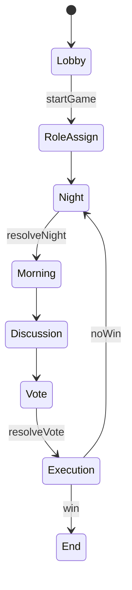

---

name: discord-werewolf-bot
overview: Discord 上で人狼ジャッジメント準拠ルールの人狼ゲームを遊べる TypeScript ベースの Discord Bot を実装する。まずは 6 役職（人狼・市民・占い師・霊能者・狩人・狂人）に限定し、後から新役職を追加しやすいアーキテクチャを設計する。
todos:

- id: setup-project
content: TypeScript + Node.js プロジェクトを作成し、discord.js を導入して基本的な起動処理と /ping コマンドを実装する
status: pending
- id: design-game-model
content: Game, Player, Role インターフェースと GameManager の型設計・実装を行う
status: pending
- id: implement-lobby-flow
content: ロビー〜役職配布までのフロー（/werewolf create, /werewolf join, /werewolf start と役職 DM 通知）を実装する
status: pending
- id: implement-core-phases
content: 夜・朝・昼・投票・処刑フェーズの最小限の進行ロジックとステートマシンを実装する
status: pending
- id: add-initial-roles
content: 人狼・市民・占い師・霊能者・狩人・狂人の 6 役職のロジックを Role 実装として追加する
status: pending
- id: implement-win-conditions
content: 村人陣営・人狼陣営の勝敗判定とゲーム終了フェーズの処理を実装する
status: pending
- id: improve-error-handling
content: コマンドの不正利用やフェーズ不一致時のエラーメッセージなどガード処理を強化する
status: pending
- id: document-role-extension
content: 新役職を追加するための手順と Role API を簡潔にドキュメント化する
status: pending
isProject: false

---

## 目的

- **目的**: JavaScript/TypeScript で Discord Bot を実装し、Discord 上で人狼ジャッジメントと同様のルール・進行で人狼ゲームを遊べるようにする。
- **第1フェーズの範囲**: 役職は「人狼」「市民」「占い師」「霊能者」「狩人」「狂人」の 6 つのみ。1村あたり 6〜8 人程度を想定し、1ギルドで複数村が同時進行できる構成を可能にする。
- **重視点**: 後から新役職・新ルールを追加しやすいように、役職やフェーズ進行をプラガブルにする。

## 全体アーキテクチャ

- **使用技術**
  - **言語**: TypeScript（Node.js ランタイム）
  - **Discord ライブラリ**: `discord.js` v14 系を想定（スラッシュコマンド & ボタン/セレクトメニュー UI 対応）
  - **構成**: 単一 Node プロジェクト。
  - **データ永続化**: 第1フェーズではメモリ上に保持（1 プロセス想定）。将来の拡張では Redis / DB に差し替えやすいように抽象化。
- **ディレクトリ構成（案）**
  - `[src/index.ts]`: Bot 起動・ログイン、イベント登録。
  - `[src/config.ts]`: 環境変数・定数（ゲーム設定、タイムアウト秒数など）。
  - `[src/discord/commands/*]`: スラッシュコマンド定義とハンドラ。
  - `[src/discord/interactions/*]`: ボタン・セレクトメニュー等のインタラクションハンドラ。
  - `[src/game/GameManager.ts]`: 村の管理（複数ゲーム管理、ゲーム作成/取得/破棄）。
  - `[src/game/Game.ts]`: 1 村分のゲームロジック（状態遷移、投票集計など）。
  - `[src/game/state/*]`: フェーズごとの状態クラス or ステートマシン実装。
  - `[src/game/roles/*]`: 役職インターフェースと各役職クラス（人狼、市民、占い師、霊能者、狩人、狂人）。
  - `[src/game/models/*]`: プレイヤー、投票、ログなどの型定義。
  - `[src/utils/*]`: 共通ユーティリティ（乱数、時間制御、ID 生成など）。
- **デザインパターン**
  - **State パターン**: 昼・夜・投票・処刑後などの進行をフェーズクラスとして表現。
  - **Strategy / Polymorphism**: 役職ごとの夜行動・勝敗判定ロジックを `Role` インターフェース実装にカプセル化し、新役職は新クラス追加で拡張。
  - **EventEmitter 風内部イベント**（任意）: プレイヤー死亡、フェーズ切り替えなどをイベントで通知し、ログ出力や統計などを疎結合に追加可能にする。

## ゲームフロー仕様（人狼ジャッジメント準拠・簡略版）

- **前提**
  - ゲームは `テキストチャンネル 1 つ = 1 村` を基本単位とする。
  - システムメッセージ・進行はその村のチャンネルに投稿。
  - 個別の夜行動（人狼の襲撃先、占い先等）は DM またはスレッド/ボタンで受け付ける（第1フェーズでは DM 優先）。
- **フェーズ一覧**
  1. **ロビー/募集フェーズ**
    - コマンドで村を作成し、参加者を募集。
    - 定員に達するか、ホストが開始コマンドを実行したらゲーム開始。
  2. **役職配布フェーズ**
    - 参加者にランダムに役職を割り当て、DM で通知。
  3. **夜フェーズ (1 夜目以降)**
    - 人狼: 襲撃先を選択（人狼同士は互いの正体を知る）。
    - 占い師: 占い先を選択し、結果を DM で返却。
    - 霊能者: 前日の処刑者の陣営を知る（2 日目以降）。
    - 狩人: 護衛先を選択。
    - 狂人: 行動なし（情報も得ない）。
    - 夜の制限時間終了、または全役職が行動完了で自動的に次へ。
  4. **朝フェーズ**
    - 夜の犠牲者を公開。死亡者のチャンネル発言を制限（幽霊モードなどのルールは簡略化して「発言不可」とする案）。
  5. **昼/議論フェーズ**
    - プレイヤーが自由に発言。
    - 制限時間終了後、投票フェーズへ。
  6. **投票フェーズ（処刑投票）**
    - 生存者に投票 UI（ボタン/セレクトメニュー）を提示。
    - 投票結果により処刑者を決定（同票はランダムか再投票、仕様を決める）。
  7. **処刑結果・勝敗判定フェーズ**
    - 処刑結果を公表し、その時点での勝敗条件をチェック。
    - 勝敗がついていない場合は再び夜フェーズへ。
  8. **ゲーム終了フェーズ**
    - 勝利陣営と各プレイヤーの役職を公開し、ゲームをクローズ。
- **簡易ステートマシン図（例）**

## 役職設計

- **共通インターフェース**
  - `Role` インターフェース（例）
    - `id`: 役職 ID（"werewolf" など）
    - `name`: 表示名
    - `team`: 陣営（`"wolf" | "village" | "madman"` など）
    - `nightActionType`: 夜行動の種類（`"attack" | "inspect" | "guard" | "none"` など）
    - `canActAt(nightNumber): boolean` 夜ごとに行動可能かどうか。
    - `performNightAction(context): Promise<void>` 行動の実装（選択 UI と結果適用を含めるか、行動選択と解決を分離するかは後述）。
- **ロジックの分離方針**
  - **行動選択**と**行動解決**を分ける：
    - 選択は Discord 側 UI（DM のボタン/セレクト）で入力。
    - 解決は Game 側の `resolveNight()` でまとめて処理。
  - 各役職は「どの種類の行動をするか」「どの制限を持つか」を宣言的に持たせ、具体的なターゲット選択・処理は共通ロジックに寄せると、新役職の追加が簡単になる。
- **第1フェーズで実装する役職**
  - **人狼 (`Werewolf`)**
    - 陣営: `wolf`
    - 夜行動: 生存者の中から 1 人を襲撃（人狼同士で共有）。
  - **市民 (`Villager`)**
    - 陣営: `village`
    - 夜行動: なし。
  - **占い師 (`Seer`)**
    - 陣営: `village`
    - 夜行動: 対象 1 人を占い、陣営を知る（結果は DM）。
  - **霊能者 (`Medium`)**
    - 陣営: `village`
    - 夜行動: 前日処刑者が人狼陣営かどうかを知る。
  - **狩人 (`Hunter`)**
    - 陣営: `village`
    - 夜行動: 1 人を護衛。護衛対象が襲撃されると死亡を防ぐ（連続護衛の可否はオプション）。
  - **狂人 (`Madman`)**
    - 陣営: `madman`（勝利条件は狼陣営と同じ、共有はしない）。
    - 夜行動: なし。
- **将来の役職追加方針**
  - 役職は `Role` インターフェースを実装したクラスを `[src/game/roles]` に追加するだけで登録できるようにする。
  - 役職リストは `RoleRegistry` などのレジストリで一元管理し、JSON 設定から利用する役職・人数を読み込める拡張を想定。

## データモデル

- **プレイヤー (`Player`)**
  - `id`: Discord User ID
  - `name`: 表示名（キャッシュ）
  - `roleId`: 割り当てられた役職 ID
  - `isAlive`: 生死フラグ
  - `isRevealed`: 役職公開済みかどうか（観戦などの拡張に使用可能）
  - `voteTargetId`: 現在の投票先（投票フェーズで使用）
- **ゲーム (`Game`)**
  - `id`: 内部ゲーム ID
  - `guildId`, `channelId`: この村の Discord 上の位置
  - `hostId`: 部屋主の Discord ID
  - `players: Player[]`
  - `phase`: 現在のフェーズ（`"lobby" | "roleAssign" | "night" | "morning" | "discussion" | "vote" | "execution" | "end"`）
  - `dayNumber`: 何日目か
  - `nightActions`: 夜行動の一時保存（人狼の襲撃先、占い先、護衛先 等）
  - `voteResults`: 投票集計結果
  - `logs`: 進行ログ
- **GameManager**
  - ゲーム ID またはチャンネル ID をキーとして `Game` インスタンスを管理。
  - 主なメソッド: `createGame`, `getGameByChannel`, `endGame`, `listGames` など。

## Discord Bot 仕様

- **起動・設定**
  - `.env` などで `DISCORD_TOKEN`, `CLIENT_ID` を設定。
  - スラッシュコマンドは起動時に Discord API へ登録（`/werewolf` 名前空間などでまとめる）。
- **メインコマンド案**
  - **`/werewolf create`**
    - 説明: 現在のチャンネルに村を作成する。
    - オプション: `max_players`（最大人数）、`roles_preset`（今回は固定で 6 役職構成）。
    - 動作: `GameManager` に新ゲームを作成し、募集メッセージを送信。ホストをコマンド実行者に設定。
  - **`/werewolf join`**
    - 説明: 作成済みの村に参加。
    - 動作: ゲーム状態がロビーの場合にのみ `players` に追加。
  - **`/werewolf leave`**
    - 説明: ゲーム開始前なら退出、開始後は「自殺」扱いか退出不可かはルールで決める（開始前のみ許可にするのが簡単）。
  - **`/werewolf start`**
    - 説明: ホストのみ使用可能。募集を締め切り、役職配布を開始。
  - **`/werewolf status`**
    - 説明: 現在のフェーズ、日数、生存者一覧を表示。
  - **`/werewolf end`**
    - 説明: 強制終了。ホスト or 管理者のみ。
- **インタラクション UI**
  - **参加ボタン**: ロビーのメッセージに「参加する」「退出する」ボタンを付ける（スラッシュコマンドと併用）。
  - **投票 UI**: 生存者一覧から選択するセレクトメニュー。
  - **夜行動 UI**: DM で対象を選ぶセレクトメニュー or ボタン。
- **エラー・例外パターン**
  - 既にゲームが存在するチャンネルで `create` した場合 → エラーメッセージ。
  - すでにゲームが存在するサーバーで `create` した場合 → エラーメッセージ（暫定）。
  - フェーズ不一致のコマンド（例: 進行中に `join`） → 使用不可メッセージ。
  - 行動済みの夜に再度行動しようとした場合 → 行動済みメッセージ。

## 勝敗条件

- **村人陣営勝利**
  - 全ての人狼が死亡したとき。
- **人狼陣営（人狼 + 狂人）勝利**
  - 生存している人狼陣営の人数が村人陣営の人数以上になったとき（人狼ジャッジメントに準拠した簡略条件）。
- **引き分け**
  - 全員死亡など想定外ケースに備えて定義（基本は発生しない）。

## 拡張性のためのポイント

- **役職追加のしやすさ**
  - 役職ごとの行動ロジックは `Role` 実装クラスに隔離し、Game のコアは「どの種類の行動を受け付け、結果をどう解決するか」だけを知る。
  - 役職は `RoleRegistry` に登録し、ゲーム作成時に「使用する役職セット」を設定で指定できるようにしておく（初期実装ではハードコードでもよい）。
- **フェーズ追加・変更のしやすさ**
  - フェーズは列挙とステートクラスで管理し、状態遷移はテーブル or メソッドで一括定義。
  - 例: `GameState` インターフェース（`enter()`, `handleTimeout()`, `onAction()` など）を実装するクラスとして `LobbyState`, `NightState` などを用意し、新しいフェーズはクラス追加で対応。
- **永続化層の抽象化**
  - 将来的な Redis / RDBMS 導入に備え、ゲーム情報へのアクセスをリポジトリインターフェース経由にする（初期は in-memory 実装）。

## テスト方針

- **ユニットテスト**
  - 役職ロジック（夜行動の結果）
  - 勝敗判定ロジック
  - 投票集計ロジック（同票、過半数など）
- **統合テスト（簡易）**
  - モックを使って、1 日分の「夜→朝→昼→投票→処刑」のフローを通す。

## 段階的実装ステップ案

1. **プロジェクト初期化**
  - TypeScript + Node.js プロジェクト作成、`discord.js` 導入、基本的な `/ping` コマンドで動作確認。
2. **ゲームモデルと GameManager の実装**
  - `Game`, `Player` 型、GameManager の作成。
3. **ロビー〜役職配布までの実装**
  - `/werewolf create`, `/werewolf join`, `/werewolf start` を実装し、役職配布と DM 通知を実装。
4. **夜フェーズ・昼フェーズ・投票フェーズの最小実装**
  - 夜行動（まずは人狼襲撃と占い）
  - 朝の結果表示
  - 昼の議論タイマー（メッセージのみ）
  - 投票と処刑
5. **残り役職（霊能者・狩人・狂人）のロジック追加**
6. **勝敗判定とゲーム終了処理**
7. **エラーハンドリング・ガード強化**
8. **簡易ログ出力・ステータス表示コマンドの充実**
9. **新役職追加のための API 整理・ドキュメント化**

